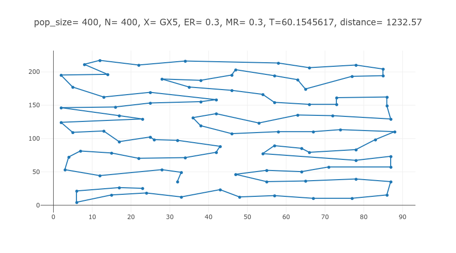

# Traveling Salesman Problem (TSP) Solver Using Traditional Island Model

This .NET application solves the Traveling Salesman Problem (TSP) using a **multi-threaded, island model** approach with TPL Dataflow for parallelism and LINQ for functional programming. The solution employs genetic algorithms with various selection, crossover, and mutation methods to optimize the path between cities.

## Table of Contents
- [Overview](#overview)
- [Features](#features)
- [Technologies](#technologies)
- [Configuration](#configuration-parameters)
- [How It Works](#how-it-works)
- [Example Output](#example-output)

## Overview

The application generates and evaluates multiple possible solutions (chromosomes) for the TSP using a genetic algorithm. TPL Dataflow is used for concurrent data processing, allowing each generation of solutions to be processed in parallel. The project supports various genetic operations such as tournament and roulette selection, crossover methods, and mutation methods.

## Features

- **Island Model Genetic Algorithm**: Multi-threaded approach for solution generation and evaluation.
- **Functional Programming**: Utilizes LINQ for functional transformations.
- **Parallelism**: Uses TPL Dataflow to manage concurrency and maximize performance.
- **Dynamic Configuration**: Configure population size, number of generations, selection methods, mutation rates, and more.

## Technologies

- .NET 6.0
- TPL Dataflow (Task Parallel Library)
- LINQ for functional programming
- XPlot.Plotly for visualization

## Configuration Parameters

Here’s a description of the main configurable parameters in `app.config`:

- **PopulationSize**: Number of chromosomes in each generation.
- **numberOfGenerations**: Total number of generations to run.
- **ElitesRatio**: Proportion of the population retained as elite members.
- **mutationProbability**: Probability of mutation in each generation.
- **SelectionMethod**: Selection strategy, options include `Tournament` or `Roulette`.
- **CrossOverMethod**: Crossover strategy, options include `CrossOver2Points`, `CrossOver1Points`, etc.
- **MutationMethod**: Mutation strategy, options include `Swapping` or `Inversion`.
- **MaxDegreeOfParallelism**: Maximum number of parallel threads for TPL Dataflow blocks.
- **BoundedCapacity**: Capacity limit for data blocks in TPL Dataflow.
- **StartingCity**: The starting city for a non-closed loop path.
- **EndingCity**: The ending city for a non-closed loop path.
- **isClosedLoop**: Boolean indicating whether the route is a closed loop (`true`) or an open path (`false`).

Adjust these settings in `app.config` to experiment with different configurations and optimize the performance and results of the TSP solution.

## How It Works

This section provides an overview of the main components and flow of the TSP Solver application, which uses a genetic algorithm to optimize the route between cities.

### Algorithm Steps

1. **Initialization**: 
   - The algorithm starts by generating an initial population of possible solutions (chromosomes). Each chromosome represents a potential route through the cities.

2. **Selection**: 
   - In each generation, pairs of chromosomes are selected based on a selection strategy, such as `Tournament` or `Roulette`. These methods determine which chromosomes will be used to create the next generation.

3. **Crossover**: 
   - Selected pairs of chromosomes undergo crossover to produce offspring. This combines the genetic information of the two parents, creating a new route that combines characteristics of both parent routes. Different crossover methods are available, such as `CrossOver2Points` and `CrossOver1Point`.

4. **Mutation**: 
   - After crossover, a mutation process is applied to the offspring to introduce variation. The mutation may randomly alter parts of a chromosome, which helps prevent the algorithm from converging too early on a suboptimal solution. Common mutation strategies include `Swapping` and `Inversion`.

5. **Evaluation**: 
   - Each chromosome is evaluated based on its fitness, which is determined by the total distance of the route it represents. The goal is to minimize the route distance, so shorter routes have higher fitness scores.

6. **Elitism**: 
   - To ensure that the best solutions are retained, the algorithm uses an elitism strategy. This involves preserving a certain proportion of the top-performing chromosomes across generations, preventing them from being lost in crossover and mutation steps.

7. **Repeat**:
   - Steps 2 through 6 are repeated for a specified number of generations or until the algorithm meets a convergence criterion.

8. **Result**:
   - The final generation contains the best solution found by the algorithm, which is then saved and visualized in an HTML file (`tsp_solution.html`).

This iterative process of selection, crossover, mutation, and evaluation gradually improves the population, driving it towards an optimal or near-optimal solution for the Traveling Salesman Problem.

You can run the application `Locally` or using `Docker`.

## Example Output

After running, the application saves an HTML file (`tsp_solution.html`) that visualizes the optimal path between cities. Open the file in a browser to view the solution.

